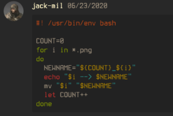
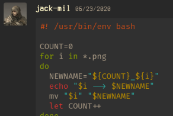
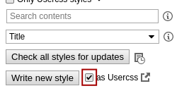
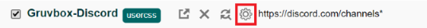
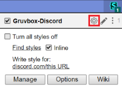

# Gruvy Discord

This is my modification to a custom css theme of Discord.  
Thanks to [ElKowar](https://github.com/elkowar/a-box-of-gruv) for the original, check out the other themes he has here https://github.com/elkowar/a-box-of-gruv.

#### Already have the [Stylus](https://add0n.com/stylus.html) Extension?  

Check out [showcase](https://github.com/jack-mil/gruvy-discord#showcase)
## Changes

This theme has many changes and additions from ElKowar's original. Green is used more commonly as an accent and defining shadows have been added. I have also created a Stylus formatted CSS theme for the Web version of Discord. This may be an easier option if you don't want to use a Discord desktop css loader.

The original theme had the same font and style for inline and block formatted code, so I changed the code blocks to use Fira Code (ligatures!)

    
Expand

Before                     | After
:-------------------------:|:-------------------------:
  |  

 

The style uses Stylus and `.user.css` preprocessor features like auto-updating and user config if installed with the badge above.

### Prerequisites

This theme uses special fonts. You'll have to either install them or change the fonts in the CSS file.

> Note: The Stylus theme downloads Fira Code web fonts, so no need to install that. The bitmap TTF font `Terminus (TTF)` is still required. Font will fallback to default otherwise

Fonts used:
- [`Terminus (TTF)`](https://files.ax86.net/terminus-ttf/) (main font)
- [`Fira Code`](https://github.com/tonsky/FiraCode) (code blocks)

> **Note:** Depending on the Terminus that you install, you may need to change body font to "`Terminus (TTF) for Windows`" (note quotes). This can be done in the style configuration.

### Installation

#### Web client:
This method may be easier to customize to those not wanting to mess with the desktop client.

Install the [Stylus](https://add0n.com/stylus.html) browser extension (available for Chrome and Firefox and probably more) to apply themes to any website (cool!)

> :bangbang: After installing Stylus, just click the badge to install!

Or, manually, see instructions from [ElKowar](https://github.com/elkowar/a-box-of-gruv):

    
Manual Installation

After installing the extension, click on the little icon and go to `manage`.
In there, you *enable* `as Usercss` and click on "write new style".

Now, select all of the text that is already there, and delete it.
The next step is to paste in the contents of the desired `.user.css` file.

If you want to change anything, make sure you set the CSS Linter to "Stylelint", 
as that one will accept the stylus syntax used here.

#### Desktop Client:

Clone or download this repo `git clone https://github.com/jack-mil/gruvy-discord.git`  
Then, use a CSS loader of your choice (e.g. [Beautiful Discord](https://github.com/leovoel/BeautifulDiscord)) and inject the [`gruvbox-desktop.css`](https://github.com/jack-mil/gruvy-discord/blob/master/gruvbox-desktop.css) file.

### Config

With *Stylus*, I have included some user variables. You can choose the fonts (body and code) if you don't like the default. After installing, click the little cog in `"manage"` or the extension icon in your browser.
___

___

It should also be trivial to change or tweak the colors as you like.
### Showcase

Original showcase by [ElKowar](https://github.com/elkowar/a-box-of-gruv)

    
Expand

## Coverage
Most UI elements have been changed and themed in some ways. Some popups are yet to be added.
- Search popup
- Add server popup
- Nitro store page (may not be possible)

Feel free to contribute or leave an issue if something is missing or needs fixing! 
